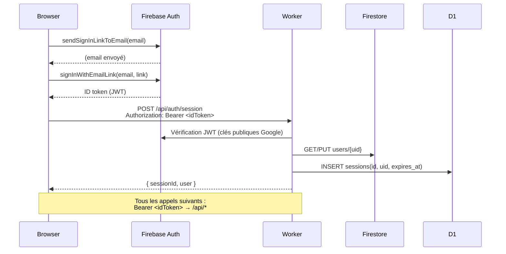

# Architecture — LOG

## Règle d'or

> Le navigateur ne parle **jamais** directement à Firestore, RTDB, R2 ou D1.
> Il appelle uniquement **(a)** le SDK Firebase Auth pour la connexion et **(b)** notre Worker à `/api/*` avec un `Authorization: Bearer <Firebase ID token>`.
> Le Worker détient tous les secrets et effectue toutes les lectures/écritures.

## Diagramme

```mermaid
graph TD
    Browser["Navigateur (React PWA)"]

    subgraph Firebase
        AuthSDK["Firebase Auth SDK\n(sign-in magic link)"]
        Firestore["Firestore\n(users, listings, bookings, reviews)"]
        RTDB["Realtime Database\n(conversations, messages)"]
    end

    subgraph Cloudflare
        Worker["Worker /api/*\n(Hono — TypeScript)"]
        R2["R2\n(photos, documents)"]
        D1["D1 SQLite\n(sessions)"]
    end

    Browser -- "(a) SDK Auth only" --> AuthSDK
    Browser -- "(b) Bearer token → /api/*" --> Worker

    Worker --> Firestore
    Worker --> RTDB
    Worker --> R2
    Worker --> D1

    Browser -. "INTERDIT (direct)" -.->|X| Firestore
    Browser -. "INTERDIT (direct)" -.->|X| RTDB
    Browser -. "INTERDIT (direct)" -.->|X| R2
    Browser -. "INTERDIT (direct)" -.->|X| D1
```

## Flux d'authentification


